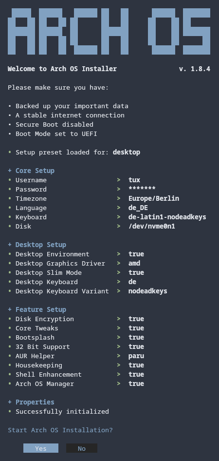

<h1 align="center">
  
  <p>Arch OS — KDE Plasma Edition</p>
</h1>

<div align="center">

**`curl -Ls is.gd/fFXzvt | bash`**

<p></p>

<p>
  
</p>

</div>

---

## О проекте

**Arch OS — KDE Plasma Edition** — это форк [Arch OS](https://github.com/murkl/arch-os) от murkl.  
Оригинал был адаптирован с GNOME на **KDE Plasma Desktop**.

---

## Быстрый старт

Загрузитесь с официального **Arch Linux ISO** и выполните:

```bash
curl -Ls is.gd/fFXzvt | bash
```

Или скачайте готовый ISO с **[релизов](https://github.com/Garbphil/arch-os-kde-installer/releases/latest)**.

---

## Что устанавливается

### Ядро
- **linux-zen** (по умолчанию), также доступны: `linux`, `linux-lts`, `linux-hardened`

### KDE Plasma
- `plasma-meta` — полное окружение KDE Plasma
- `kde-applications-meta` — пакет приложений KDE
- **DM:** SDDM с автовходом
- **Тема:** Breeze + Papirus иконки

### Драйверы графики (на выбор)
| Драйвер | Для кого |
|---|---|
| `mesa` | Универсальный / fallback |
| `intel_i915` | Intel Graphics |
| `nvidia` | NVIDIA (DKMS + Wayland) |
| `amd` | Современные AMD GPU |
| `ati` | Старые AMD/ATI GPU |

### Аудио
- `pipewire` + `wireplumber` (ALSA, PulseAudio, JACK)

### Оболочка (Shell Enhancement)
`starship`, `eza`, `bat`, `zoxide`, `fd`, `fzf`, `fastfetch`, `mc`, `btop`, `nano`, `fish` (опционально)

### Сеть и шары
- NetworkManager + VPN-плагины (OpenVPN, L2TP, SSTP, PPTP, OpenConnect, StrongSwan)
- Samba, wsdd, Avahi, ModemManager

### Кодеки и мультимедиа
`ffmpeg`, `gstreamer` (full), `libdvdcss`, `libheif`, `webp-pixbuf-loader`, `openh264`, `x264`, `xvidcore`, `flac`, `opus` и др.

### Утилиты
`git`, `curl`, `wget`, `p7zip`, `zip`, `unrar`, `gparted`, `ark`, `kate`, `dolphin`, `konsole`, `gwenview`, `spectacle`, `kdenlive`, `kcalc`, `kolourpaint`, `gdb`, `python`, `go`, `rust`, `nodejs`, `lua`, `cmake`, `jq`

### Шрифты
FiraCode Nerd Font, Noto (включая CJK и Emoji), Liberation, DejaVu, Adobe Source

### Прочее
- Gamemode, Flatpak (xdg-desktop-portal-kde), KDE Connect
- CUPS (печать), Bluetooth, fwupd
- BTRFS + Snapper (опционально), ZRAM (zstd)
- LUKS2 шифрование (опционально)
- GRUB или systemd-boot (на выбор)

---

## Оригинальный автор

Проект основан на [Arch OS](https://github.com/murkl/arch-os) от **murkl** (GPL v2).  
Спасибо ему за отличную основу!